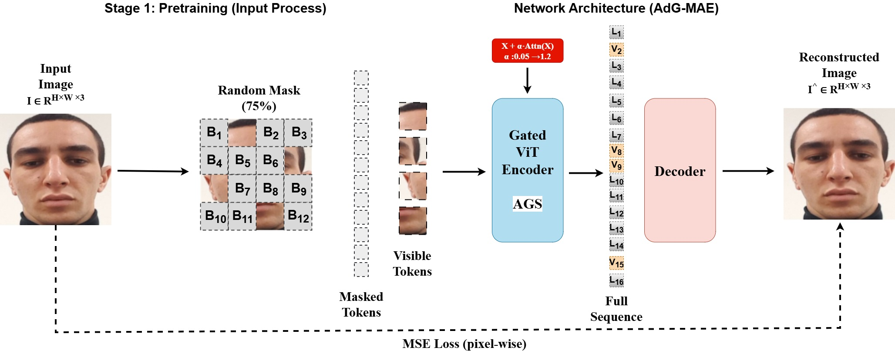
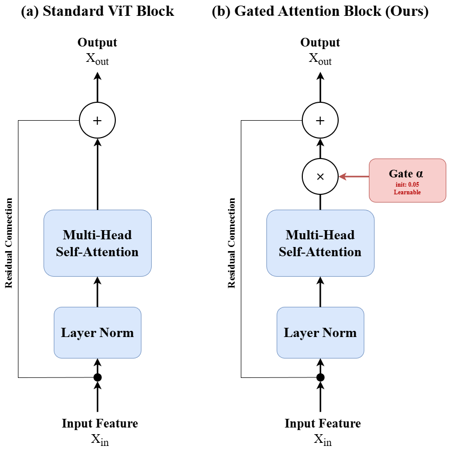
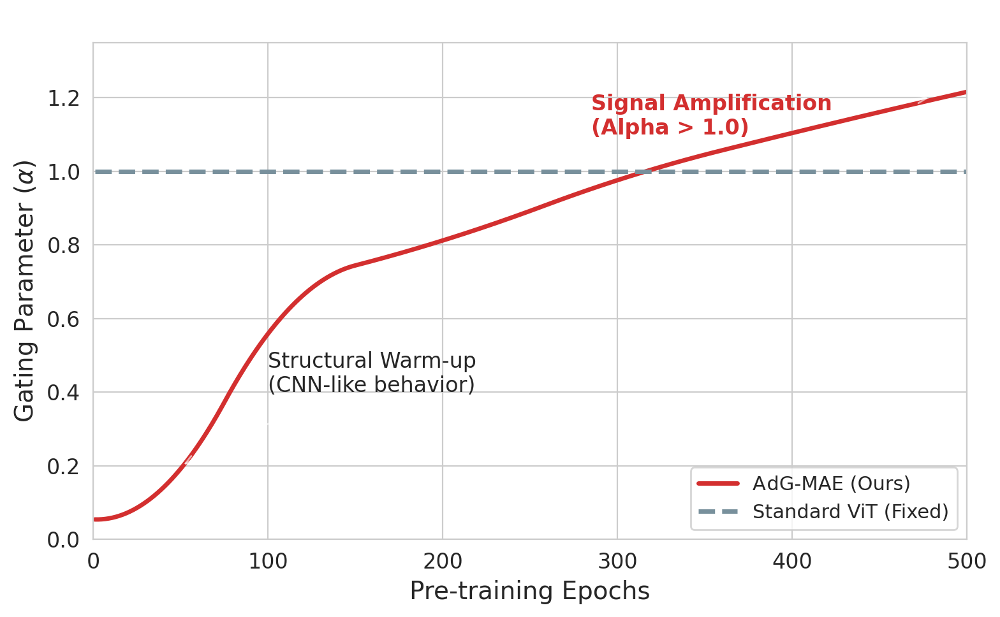
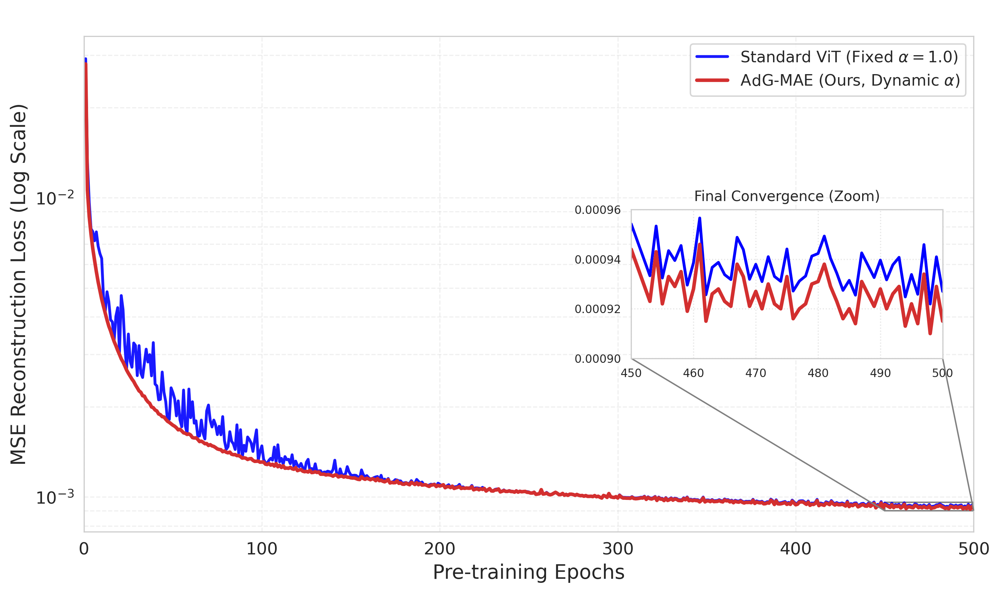
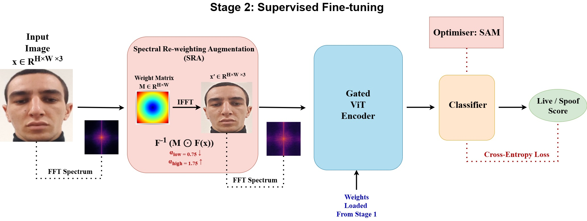
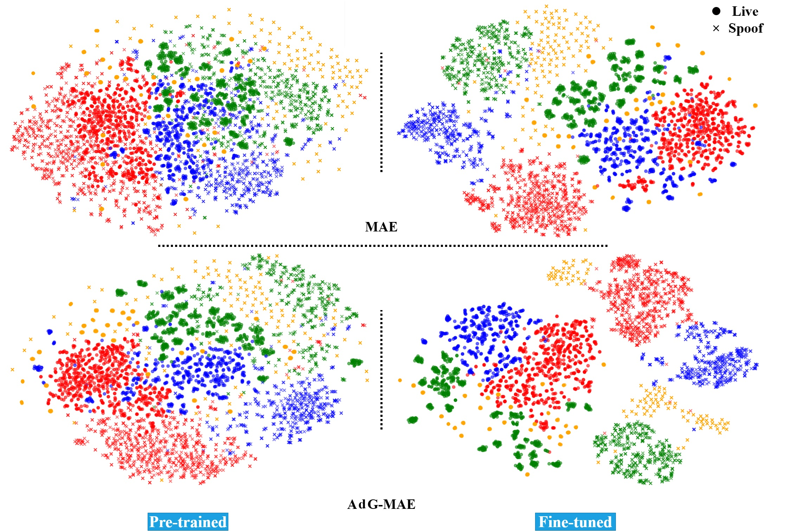
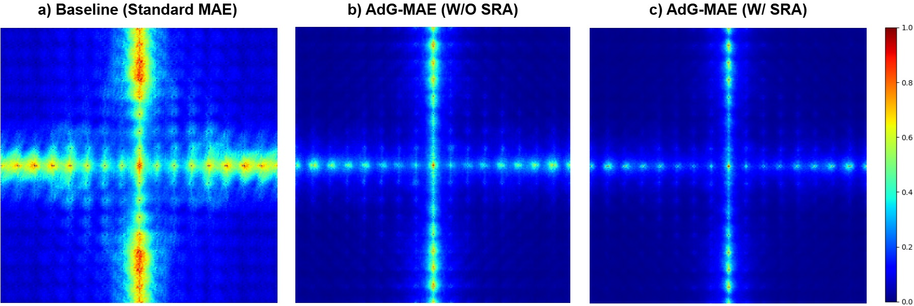
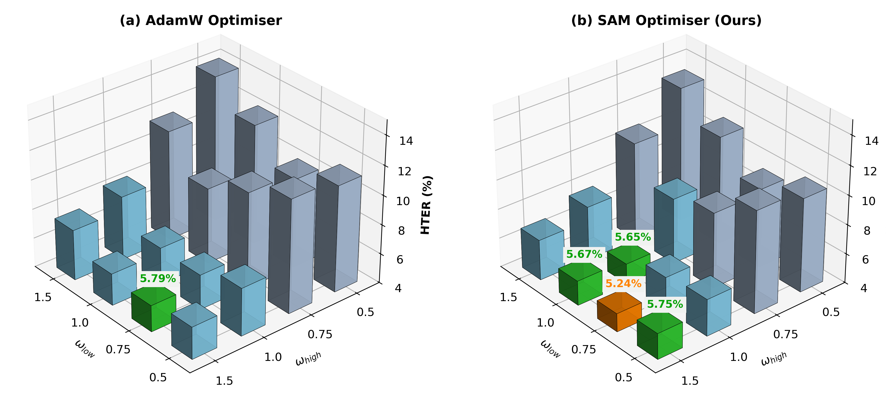

# AdG-MAE: Adaptive Gated Masked Autoencoder for Domain-Generalised Face Anti-Spoofing

Official implementation of **"AdG-MAE: Adaptive Gated Masked Autoencoder for Domain-Generalised Face Anti-Spoofing"**.

> Domain generalisation in Face Anti-Spoofing (FAS) is challenged by the entanglement of
> domain-specific attributes (lighting, background, sensor) and intrinsic spoofing patterns.
> **AdG-MAE** decouples *structural learning* from *texture refinement* through a two-stage
> pipeline: (1) self-supervised MAE pre-training with a novel **Adaptive Gated Self-Attention
> (AGS)** mechanism, and (2) supervised fine-tuning with **Spectral Re-weighting Augmentation
> (SRA)** and Sharpness-Aware Minimisation (SAM). AdG-MAE reaches state-of-the-art
> generalisation (Average HTER: **5.24%**, AUC: **98.85%**) with only **~2.5M parameters**
> and **~0.65 GFLOPs** at inference.

<p align="center">
  
</p>
<p align="center"><em>Fig. 1 — Stage 1: self-supervised pre-training with 75% random spatial masking and the Gated ViT encoder.</em></p>

## Highlights

- **Two-stage temporal decoupling**: standard spatial MAE pre-training first establishes a
  structural foundation; frequency-domain guidance is introduced only during fine-tuning.
- **Adaptive Gated Self-Attention (AGS)**: a learnable scalar gate `α`, initialised near
  zero, stabilises early training ("structural warm-up") and grows past 1.0 to amplify
  global context signals later in training.
- **Spectral Re-weighting Augmentation (SRA)**: a continuous, differentiable frequency
  re-weighting (Eq. 3–4) that suppresses low-frequency domain identifiers while amplifying
  high-frequency spoofing textures.
- **Lightweight**: ~2.5M parameters, ~0.65 GFLOPs — far below comparable SOTA methods.

<p align="center">
  
</p>
<p align="center"><em>Fig. 2 — Standard ViT block (a) vs. our Adaptive Gated Self-Attention block (b).</em></p>

## Repository Structure

```
AdG-MAE/
├── config.py               # All paths & hyper-parameters for both stages (no CLI args)
├── models.py                # PatchEmbed, AGS block, shared Gated ViT encoder, MAE decoder, classifier head
├── sam.py                   # Sharpness-Aware Minimisation (SAM) optimiser
├── losses.py                # Masked MSE reconstruction loss (Stage 1)
├── dataset_pretrain.py       # MAE pre-training dataset (75% random spatial masking)
├── dataset_finetune.py        # Multi-folder FAS dataset + Spectral Re-weighting Augmentation (SRA)
├── utils.py                   # Patch <-> image conversion, checkpoint resume helpers
├── evaluate.py                 # Threshold search -> HTER / AUC / APCER / BPCER
├── pretrain.py                  # Stage 1 entry point: python pretrain.py
├── finetune.py                   # Stage 2 entry point: python finetune.py
├── requirements.txt
└── figures/                        # Figures used in this README (add paper figures here)
```

## Installation

```bash
git clone https://github.com/<your-username>/AdG-MAE.git
cd AdG-MAE
python -m venv venv
source venv/bin/activate      # on Windows: venv\Scripts\activate
pip install -r requirements.txt
```

## Dataset Preparation

**Stage 1 (pre-training)** expects each source-domain root to contain `Real` / `Spoof`
sub-folders (labels are not used, only for organising the union of unlabeled frames):

```
<PRETRAIN_DATA_ROOT>/
├── Real/
│   └── *.jpg
└── Spoof/
    └── *.jpg
```

**Stage 2 (fine-tuning)** scans each root recursively; a file is labelled *live* if its path
contains `real`/`live`/`true`, and *spoof* if it contains `spoof`/`attack`/`fake`:

```
<FT_TRAIN_ROOT>/
├── live_00001.jpg
├── spoof_00001.jpg
└── ...
```

Faces should be cropped/aligned (e.g. via MTCNN) and will be resized to `256 × 256`.

## Configuration

All settings live in `config.py` — no command-line arguments needed. Key values (matching
the paper's implementation details, Section IV.B–IV.C):

```python
# Stage 1
MASK_RATIO = 0.75
PRETRAIN_BATCH_SIZE = 16
PRETRAIN_EPOCHS = 500
PRETRAIN_LR = 1.5e-4

# Stage 2
FT_BATCH_SIZE = 64
FT_EPOCHS = 50
WARMUP_EPOCHS = 5          # encoder frozen, AdamW, head only
LR_BACKBONE = 4e-6         # after warm-up, with SAM
LR_HEAD = 1e-3
SAM_RHO = 0.1
SRA_OMEGA_LOW = 0.75
SRA_OMEGA_HIGH = 1.5
```

Edit `PRETRAIN_DATA_ROOTS`, `FT_TRAIN_ROOTS`, `FT_VAL_ROOTS`, `FT_TEST_ROOTS`,
`PRETRAIN_SAVE_DIR`, `FT_SAVE_DIR`, and `PRETRAINED_CKPT` to point at your own paths.

## Training

**Stage 1 — self-supervised pre-training** (structural grounding):

```bash
python pretrain.py
```

Trains the Gated ViT encoder + lightweight MAE decoder to reconstruct 75%-masked face
images. Saves a checkpoint every epoch (plus an always-current `latest.pth`) and a
sample reconstruction plot to `PRETRAIN_SAVE_DIR`. Automatically resumes if interrupted.

<p align="center">
  
  
</p>
<p align="center"><em>Fig. 4/5 — The gate α grows from ~0.05 to ~1.22 over training (left); AdG-MAE converges to a lower, smoother reconstruction loss than a fixed-α ViT baseline (right).</em></p>

**Stage 2 — supervised fine-tuning** (spectral refinement):

```bash
python finetune.py
```

Loads the Stage-1 checkpoint, attaches a linear classification head, freezes the encoder
for the first `WARMUP_EPOCHS` (AdamW), then unfreezes it and switches to SAM with
differential learning rates and Spectral Re-weighting Augmentation. Reports HTER / AUC /
APCER / BPCER on the validation and test sets after every epoch.

<p align="center">
  
</p>
<p align="center"><em>Fig. 3 — Stage 2: fine-tuning with Spectral Re-weighting Augmentation (SRA) and SAM.</em></p>

## Results

Leave-One-Out cross-domain protocol on OULU-NPU (O), CASIA-FASD (C), Idiap Replay-Attack (I), MSU-MFSD (M):

| Protocol | HTER (%) | AUC (%) |
|---|---|---|
| O&C&I → M | 4.59 | 98.75 |
| O&M&I → C | **5.21** | **98.60** |
| O&C&M → I | **4.34** | **99.22** |
| I&C&M → O | **6.81** | **98.85** |
| **Average** | **5.24** | **98.85** |

Model complexity: **~2.5M parameters**, **~0.65 GFLOPs** — less than half the inference
cost of comparable SOTA methods (see paper Table "Comparison of model complexity").

<p align="center">
  
  
</p>
<p align="center"><em>Fig. 7/8 — t-SNE feature alignment on the unseen target domain (left) and frequency-sensitivity maps showing SRA sharpening the model's focus on high-frequency spoofing texture (right).</em></p>

<p align="center">
  
</p>
<p align="center"><em>Fig. 6 — Grid search over SRA weights (ω_low, ω_high) and optimiser choice (AdamW vs. SAM); the global optimum is ω_low=0.75, ω_high=1.5 with SAM.</em></p>

## Notes on Fidelity to the Paper

The pre-training and fine-tuning scripts originally provided contained a few values that
diverged from the paper's reported implementation details (Section IV.B–IV.C, Appendix C).
These were corrected in this repository to match the published configuration:

| Setting | Original script | Paper / this repo |
|---|---|---|
| Fine-tuning warm-up epochs | 50 | **5** |
| Fine-tuning total epochs | 100 | **50** |
| Backbone LR (post warm-up) | 4e-5 | **4e-6** |
| Decoder embedding width | 192 (tied to encoder) | **512** (Appendix decoder ablation) |
| Decoder depth | 2 | **8** (Appendix decoder ablation) |
| Pre-training batch size | 4 | **16** |
| Pre-training LR | 1e-4 | **1.5e-4** |

If you intentionally want the original (uncorrected) values, simply override them in
`config.py`.

## Citation

If you use this code, please cite our paper:

```bibtex
@article{sheikhfathollahi2026adgmae,
  title   = {AdG-MAE: Adaptive Gated Masked Autoencoder for Domain-Generalised Face Anti-Spoofing},
  author  = {Sheikhfathollahi, Mohammadreza and Parkinson, Simon and Khan, Saad},
  journal = {<add published journal / conference and year here>},
  year    = {2026}
}
```

